  <a href="https://guraygur.me"><strong>Explore my portfolio ↗</strong></a> &nbsp;&nbsp; / &nbsp;&nbsp;
  <a href="https://www.linkedin.com/in/guraygur/">LinkedIn ↗</a> &nbsp;&nbsp; / &nbsp;&nbsp;
  <a href="https://medium.com/@guraygur">Writing ↗</a>

 

### A builder with a creative background.

I'm **Güray**, a computer engineering student working at the intersection of **AI, automation, and digital media**. I build tools for the workflows I use, work with content teams, and learn by putting ideas into practice.

 

### Selected work

<table>
<tr>
<td width="50%" valign="top">
01 / AUTOMATION
<h3>From manual tasks to connected workflows.</h3>

A custom Python management panel connected to n8n, with AI-assisted analysis and task assignment for my team.

<code>Python</code> <code>n8n</code> <code>AI workflows</code>

<a href="https://www.linkedin.com/feed/update/urn:li:activity:7427437145943900160/"><strong>Read the build story ↗</strong></a>
  
</td>
<td width="50%" valign="top">
02 / CREATIVE OPERATIONS
<h3>Content production. Built as a system.</h3>

Combining creative direction, team coordination, and automation across 4+ global content channels.

<code>Content strategy</code> <code>Automation</code>

<a href="https://www.linkedin.com/feed/update/urn:li:activity:7402377259329667073/"><strong>Explore the results ↗</strong></a>
  
</td>
</tr>
</table>

 

### Tools & direction

**Building with** &nbsp; Python · n8n · Git · SQL  
**Creating with** &nbsp; Blender · Video & photo editing  
**Learning deeply** &nbsp; Algorithms · Machine learning · Data

 

---

**Have something worth building?**  
Open to internships and collaborations in AI, automation, and software.

[Let's connect ↗](https://www.linkedin.com/in/guraygur/) &nbsp; · &nbsp; [guraygur.me](https://guraygur.me)
